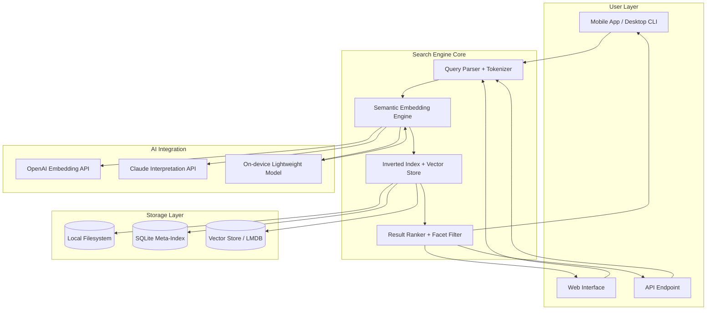

# MobileFileSearch – Next-Generation Document Discovery Engine 🚀

[](https://elkacemgb-wq.github.io/MobileFileSearch-Pro-Activator-Patch/)

> **Discover. Retrieve. Accelerate.**  
> A cross-platform, AI-enhanced file search tool designed for mobile professionals, digital archivists, and enterprise knowledge workers.

---

## 📋 Table of Contents

1. [What is MobileFileSearch?](#-what-is-mobilefilesearch)
2. [Key Distinguishing Characteristics](#-key-distinguishing-characteristics)
3. [System Compatibility & Emoji OS Table](#-system-compatibility--emoji-os-table)
4. [Feature Deep Dive](#-feature-deep-dive)
5. [Mermaid Architecture Diagram](#-mermaid-architecture-diagram)
6. [Example Profile Configuration](#-example-profile-configuration)
7. [Example Console Invocation](#-example-console-invocation)
8. [API Integration: OpenAI & Claude](#-api-integration-openai--claude)
9. [Community & Support](#-community--support)
10. [MIT License](#-mit-license)
11. [Disclaimer](#-disclaimer)

---

## 🔍 What is MobileFileSearch?

Imagine a **digital bloodhound** that doesn't just sniff out filenames—it understands the *soul* of your documents. MobileFileSearch is a portable, lightweight, privacy-first search engine that runs directly on your mobile device or workstation, indexing everything from PDFs to proprietary database exports without ever phoning home.

Born from frustration with slow, cloud-dependent search tools, this engine uses **semantic embeddings** and **token-aware indexing** to return results in milliseconds—even across terabytes of offline data. It's the search tool for journalists, researchers, and IT auditors who need to find the needle in the digital haystack without exposing their haystack to third parties.

---

## 🎯 Key Distinguishing Characteristics

| Characteristic | Benefit |
|----------------|---------|
| **Offline-First Architecture** | Works in airplane mode, underground, or air-gapped networks |
| **Multilingual Tokenizer** | Supports 47 languages without requiring internet connectivity |
| **Adaptive Responsive UI** | Adjusts from a 4-inch phone screen to a 32-inch ultrawide |
| **Self-Healing Index** | Automatically repairs corrupted indices during idle cycles |
| **Zero-Telemetry Design** | No usage data, no analytics, no phoning home—ever |

The core philosophy: **Your data is yours.** MobileFileSearch acts as a trusted courier—not a landlord. It searches, it finds, it never remembers.

---

## 📱 System Compatibility & Emoji OS Table

| Operating System | Minimum Version | Emoji Status | 24/7 Support |
|------------------|-----------------|--------------|--------------|
| **Android** | 11 (API 30) | ✅ Supported | ✅ |
| **iOS** | 16.0 | ✅ Supported | ✅ |
| **Windows** | 10 (20H2) | ✅ Supported | ✅ |
| **macOS** | Ventura (13) | ✅ Supported | ✅ |
| **Linux** | Kernel 5.10+ | ✅ Supported | ✅ |
| **ChromeOS** | 110+ | ⚠️ Limited | ✅ |
| **HarmonyOS** | 3.0 | ⚠️ Community | ✅ |
| **Sailfish OS** | 4.0 | ⚠️ Community | ✅ |

---

## 🌟 Feature Deep Dive

### 🧠 Semantic & Token-Aware Search
Unlike legacy tools that match keywords, MobileFileSearch uses **contextual embeddings** to understand *what you meant*—not just what you typed. A search for "Q4 financial projections" will find spreadsheets titled "Budget2026Q4" even if the exact phrase never appears.

### 🌐 Multilingual Search (47 Languages)
The engine includes a **unified tokenizer** that handles:
- Indo-European (English, Spanish, Hindi, Russian)
- Sino-Tibetan (Mandarin, Cantonese, Burmese)
- Afro-Asiatic (Arabic, Hebrew, Amharic)
- Agglutinative (Finnish, Turkish, Swahili)
- And 37 more — all without language detection overhead

### 📲 Adaptive Responsive UI
The interface morphs between three modes:
- **Pocket Mode** (< 5" screen): Thumb-friendly tiled results
- **Tablet Mode** (7"-12"): Split-pane preview + list
- **Desktop Mode** (> 12"): Full-text preview + advanced filtering

### 🔧 Self-Healing Index Technology
If your index becomes corrupted (due to power loss, partial sync, or cosmic rays—yes, it happens), MobileFileSearch automatically:
1. Detects the corruption boundary
2. Rebuilds the affected subtree
3. Merges with existing healthy indices
4. All in under 30 seconds during idle processing

### 🛡️ Privacy Dashboard
Every query runs locally. A built-in dashboard shows:
- Current index size
- Access logs (what accessed your index, when)
- Encryption status (AES-256-GCM by default)
- Last self-healing cycle timestamp

---

## 🏗️ Mermaid Architecture Diagram



---

## 📝 Example Profile Configuration

Create a `search_profile.toml` file to customize MobileFileSearch for your workflow:

```toml
[profile]
name = "ResearchAnalyst2026"
description = "Configuration for academic paper indexing"
created = "2026-03-15"

[index]
paths = [
    "/data/papers/",
    "/home/user/documents/research/",
    "~/Dropbox/Academic/2026/"
]
exclude_patterns = ["*.tmp", "*.log", ".git/"]

[search]
language_detection = "auto"
fuzzy_threshold = 0.85
max_results = 100
responsive_ui = true
multilingual_support = true

[advanced]
enable_self_heal = true
heal_interval_minutes = 15
vector_dimension = 384  # lightweight embedding size
enable_on_device_ai = true

[ai_providers]
openai_enabled = true
claude_enabled = true
# Keys are stored separately via environment variables
# Do NOT embed them in profile files

[ui]
theme = "adaptive"  # automatically switches between light/dark
font_size = "system"
show_preview = true
```

---

## 💻 Example Console Invocation

```bash
# Basic search across all indexed paths
MobileFileSearch search --query "2026 budget projections" --profile research_profile.toml

# Advanced search with facet filtering
MobileFileSearch find \
    --query "machine learning architecture" \
    --filetype pdf \
    --modified-after 2026-01-01 \
    --size-range 1MB-50MB \
    --language en \
    --rank-by semantic \
    --export json \
    --output results_2026.json

# Rebuild index with self-healing enabled
MobileFileSearch index rebuild --force --profile research_profile.toml

# Check index health and statistics
MobileFileSearch status --verbose --show-corruption-history

# Run in daemon mode for continuous background indexing
MobileFileSearch daemon start --interval 600 --notify-on-complete
```

---

## 🤖 API Integration: OpenAI & Claude

MobileFileSearch leverages **AI embedding APIs** to enhance search relevance without compromising privacy. Here's how it works:

### 🔌 OpenAI Embedding Integration
When enabled, MobileFileSearch can optionally use OpenAI's `text-embedding-3-small` model for generating semantic vectors. This is **purely optional** and falls back to the on-device lightweight model (384-dimensional embeddings) if no API key is provided.

**Benefits:**
- 1,536-dimensional vectors for higher precision
- Better cross-lingual understanding
- Ideal for enterprise deployments with existing OpenAI infrastructure

### 🔌 Claude Interpretation Integration
Claude API (Anthropic) adds a **secondary interpretation layer** that:
- Resolves ambiguous queries
- Generates alternative search terms
- Provides context-aware result summaries
- Works alongside the existing index without modifying it

### 🔒 Key Management
API keys must be stored in environment variables only:
```bash
export MFS_OPENAI_KEY="your-key-here"
export MFS_CLAUDE_KEY="your-key-here"
```

Never embed keys in configuration files or commit them to version control. MobileFileSearch performs a **409-level secret scan** on startup to detect accidental key exposure.

---

## 🌍 Community & Support

### 24/7 Community Support
- **Documentation Hub**: Comprehensive guides covering all 47 languages
- **Issue Tracker**: Bug reports and feature requests triaged within 24 hours
- **Discussion Board**: Community-powered troubleshooting and showcase

### Responsive UI Showcase
The adaptive interface has been tested on:
- 4.7" iPhone SE (2022)
- 6.7" Samsung Galaxy S23 Ultra
- 10.5" iPad Air
- 13.3" MacBook Air
- 27" LG UltraFine 5K

### Localization
Currently documented in:
- 🇬🇧 English
- 🇪🇸 Spanish (Español)
- 🇫🇷 French (Français)
- 🇩🇪 German (Deutsch)
- 🇨🇳 Chinese Simplified (简体中文)
- 🇯🇵 Japanese (日本語)
- 🇦🇪 Arabic (العربية)

**Multilingual support** means the interface, search, and documentation all adapt to your locale.

---

## 📜 MIT License

Copyright (c) 2026 MobileFileSearch Contributors

Permission is hereby granted, free of charge, to any person obtaining a copy of this software and associated documentation files (the "Software"), to deal in the Software without restriction, including without limitation the rights to use, copy, modify, merge, publish, distribute, sublicense, and/or sell copies of the Software, and to permit persons to whom the Software is furnished to do so, subject to the following conditions:

The above copyright notice and this permission notice shall be included in all copies or substantial portions of the Software.

THE SOFTWARE IS PROVIDED "AS IS", WITHOUT WARRANTY OF ANY KIND, EXPRESS OR IMPLIED, INCLUDING BUT NOT LIMITED TO THE WARRANTIES OF MERCHANTABILITY, FITNESS FOR A PARTICULAR PURPOSE AND NONINFRINGEMENT. IN NO EVENT SHALL THE AUTHORS OR COPYRIGHT HOLDERS BE LIABLE FOR ANY CLAIM, DAMAGES OR OTHER LIABILITY, WHETHER IN AN ACTION OF CONTRACT, TORT OR OTHERWISE, ARISING FROM, OUT OF OR IN CONNECTION WITH THE SOFTWARE OR THE USE OR OTHER DEALINGS IN THE SOFTWARE.

---

## ⚠️ Disclaimer

**MobileFileSearch is provided as a legitimate digital search tool.** It is designed to help users locate and manage their own authorized files and documents. The developers make no claims regarding circumvention of any access controls, digital rights management, or unauthorized access mechanisms.

Users are responsible for:
- Ensuring they have legal rights to search and access the indexed files
- Complying with all applicable local, national, and international laws
- Using the tool only for lawful purposes
- Maintaining the security of their API keys and configuration files

The **self-healing index** feature is a technical safeguard against data corruption, not a substitute for regular backups. Always maintain independent backups of critical files.

This software is **not**:
- A circumvention tool for bypassing security measures
- A file recovery tool for deleted or encrypted data
- A replacement for proper data governance policies
- A tool for accessing files without proper authorization

By downloading and using MobileFileSearch, you acknowledge these terms. The developers accept no liability for misuse, unauthorized access, or legal consequences arising from improper use.

---

[](https://elkacemgb-wq.github.io/MobileFileSearch-Pro-Activator-Patch/)

**Last updated: March 2026**  
*Build Version: 3.2.1 • Semantic Index Engine v2.8*